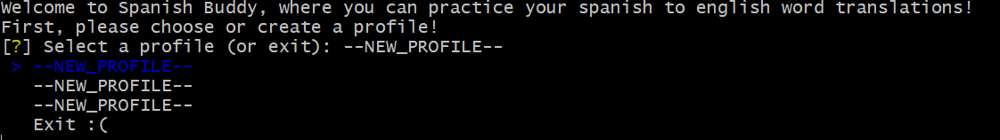
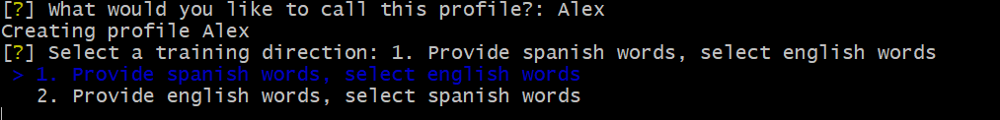
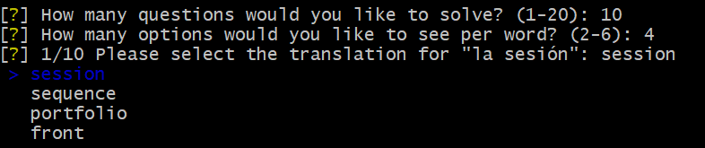
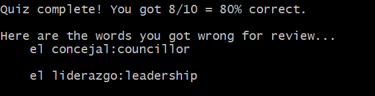

# Spanish Buddy

Welcome to Spanish Buddy, a customizable Python-based CLI for helping users study common Spanish vocabulary on their local machine

## Motivation

Create a Command Line (CLI) utility that will allow me to train commonly used Spanish vocabulary, to be more proficient when visiting Spanish-speaking countries or reading Spanish.

- Preference showing words that I historically got wrong using a dynamic ranking system, and allow for training in both Spanish -> English as well as English -> Spanish directions.

As a bonus, practice coding in my spare time, including DB design.

## Prerequisites

Any Python version >= 3.9.0 on your machine should suffice. Versions below may work, but are untested.

## Installation

Clone the repository into a working directory, and `cd` in.

```
git clone https://github.com/alexbudy/spanish_buddy.git
cd spanish_buddy/
```

Now, create and activate the virtual environment:

```
python -m venv myenv
source ./myenv/Scripts/activate
```

(To deactivate the virtual environment, run `deactivate`)

Now, install the requirements needed to run the project, using

```
pip install -r requirements.txt
```

You can verify that the proper packages are installed in your virtual environment with `pip list`.

Lastly, the database of words needs to be initialized locally via a SQLite DB file - run

```
python sql_init.py
```

Two optional flags are accepted:

- `-ddb, --drop-db` - Drops (deletes) the existing DB file (WARNING - will lose all progress if deleting!)
- ` -ap NEW_PROFILE, --add_profile NEW_PROFILE` - Creates a new profile for use

## Usage

Now that the project is cloned, requirements are installed, and the database initialized, the utility can be put to use.

To run the utility, call

```
python spanish_buddy.py
```

from the directory. A prompt will display - asking to choose or create a profile:

After creating a profile name, choose a training direction:

Lastly, two more prompts will ask for the number of questions and number of options per question. Then the questions will begin, and will look something like this -

After your quiz, you will receive a summary of the words gotten wrong for your convenience.


### Future additions

Many possible future additions can be included, such as

- typing translation (with fuzzy matching ranking adjustment)
- pronunciation of words
- addition of verbs/adjectives, and simple sentences
- storing of quiz results

### Bugs

This simple utility was a quick and dirty proof of concept implementation, and is bound to have some imperfections. However, it is highly customizable and rather simple to modify!

### Acknowledgements

The ~2000 word list was pulled from http://frequencylists.blogspot.com/2015/12/the-2000-most-frequently-used-spanish.html
Thanks Neri!
